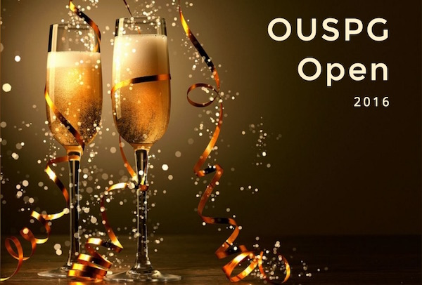

# OUSPG Open - Summer of Buzz with Fresh Blood, Alumni and Affiliates

TLDR; Wanna hack for fun? Have studies to complete?
[Need a job in infosec](https://www.youtube.com/watch?v=xucgT9BBzIE)?
Come to OUSPG to make cunning plans!

OUSPG presents, in the spirit of the Google Summer of Code:

* ~~Young~~, ~~Old~~, **Enthusiastic**, Tweaker, Pro, Wanna-be or interested
  in the Information Security or Hacking stuff?
* Still looking for something small or big to do during summer?
* Have a pet project? Need a topic? Need a project? Need a team? B.Sc/M.Sc/PhD
  thesis to write?
* Student, Worker, Affiliate, Alumni?
* Want to learn new stuff, new tools or create an impact crater on the
  tech and security landscape?
* [Contribute](https://youtu.be/3yS0pnfXpBQ) to interesting open
  source projects out there?
* Or just get a few good pointers for your project/thesis from people
  that have been in the field for over 10 years?

If any (or none) of the above matches you, come and talk to us about it.
See below for the time and place of our next OUSPG Open (doors) session.

If you want to come masked or anonymous you are most welcome,
no need to reserve in advance.

If you want to impress your cousin you may make a pull request
against this file to this repo and reserve your slot. :)

If still lost but curious, join #ouspg @ IRCnet.

## Something for the future

* What we learned from (insanely) repo-centric workflow

## June - August 2016: Weekly phun & terror filled this space

OUSPG Open 2016 is now closed. We would like to thank contributors,
participants, and anyone who was mentioned in this journal. (We hope we
didn't forget anyone!) Encounters and
interactions were one of the best things for us this summer!

As of 2016-08-3, it has been almost 3 months since we
[started](https://youtu.be/YYGVykWtk2s). Since that a lot has happened.
[honeypots](http://github.com/ouspg/honeypots) project was completed,
with smaller image size than the closest alternative,
[urlhandlers](https://github.com/ouspg/urlhandlers) took a leap in research
and [awareness](https://github.com/ouspg/urlhandlers/blob/master/doc/tracking.md).
[libfuzzerfication](https://github.com/ouspg/libfuzzerfication) simplified
fuzzing, and [TryTLS](https://github.com/ouspg/trytls) has already
started making impact to the security of programming languages.

### Tue 2016-08-30 Minimum Viable Award Gala @ Tellus Stage, Linnanmaa Campus (12:00-17:00)

*OUSPG Open Minimum Viable Gala closed our summer.
Click the image to watch the slides, summarizing the results.*

* In this session, we celebrated and reflected what got done. We gave awards
  in different categories.
  We would like to thank the external our judges:
  * Tomi Tuominen ([T2](http://www.t2.fi/) & F-Secure) - we named your award as
    *scene impact award*,
  * David Chartier (Synopsys) - we named your award as *marketing award*,
  * Kostya Serebryany & Abhishek Arya (Google) - we named your
    award as *Google award* (OUSPG Open was funded with Google Grant)
* Food & Sauna @ CWi home in the evening
* Jani Tuovila (@replicant2020) from Bittium
* Anna-Maija Juuso from Oulu University visited us afterwards to hear how the
  summer went.

### Tue 2016-08-23 @ All Over Oulu

This Tuesday, we enjoyed the company of five different companies in
Oulu. As we went on, we tried to hijack people from previous
company to the next with some success.

* [Synopsys](http://www.synopsys.com/software/Pages/default.aspx)
  * Antti Kiiveri introduced Synopsys in general and Teemu Vaskivuo
   (@tevas) presented AbuseSA. We learned that Synopsys has a number
   of openings today, and more are coming up for different topics.
  * Matti Kamunen talked about Defensics, and finally
  * Sampo Niittyviita entertained us with his bachelor thesis.
    presentation dealing with [ISTQB](http://www.istqb.org/) testing.
    We found familiar ground reflecting Sampo's work trough
    security audits.
* Checked out the new [Kielo](http://kielo.com/) premises and met
  with one of their residents, [Radai](http://radai.fi/).
  * Jarkko Ruottinen explained the idea of Kielo, Christian Wieser from Radai
    showecased fancy drones, used for everything else except photography.
* [F-Secure](https://www.f-secure.com)
  * Sami Hyvönen presented F-Secure in general and Samu Sarivaara
    presented Rapid Detection service. We were glad to see F-Secure
    has grown in Oulu, and is eager to grow some more. They are also hiring!
  * We also met [Atte Kettunen](https://youtu.be/RScnahkajKw) (@attekett) first
    time with his new hat on (he moved from OUSPG to F-Secure)
* [Prove](https://prove.fi/) - last but not least! We were
    inspired by CEO, Antti Niittyviita.
  * Prove indeed is a very successful company, probably due to all
    the hard work with the feet on the ground.
  * Antti recommended Simon Senek's TEDx-talk
    [How great leaders inspire action](https://www.ted.com/talks/simon_sinek_how_great_leaders_inspire_action).
  * He shared with us Prove's ups and downs. It Proved to be very
    good session, as we discovered the [truth](thetruth.png)

### Tue 2016-08-16 @ Tellus Innovation Arena, Linnanmaa Campus (12:00-17:00)

* It was a busy day. We had two tracks.
  * [TryTLS shootout Round II](https://github.com/ouspg/trytls/tree/master/shootout)
  * [Aapo Audit Round II](https://github.com/ouspg/aapo-audit)
* TryTLS shootout -sprint started already at 09:00 with internal QA-work.
* 09:00 TryTLS shootout-0.3alpha
  * found fixable TryTLS issues
* 10:30 Review and head off to shootout-0.3beta
* 12:00 Aapo Audit Round II [(etherpad)](http://muistio.tieke.fi/p/aapo-audit),
  and shootout continues
    * We had special guest star Juhani Eronen from NCSC-FI participating
* 14:30 shootout II Review and head off to shootout-0.3
* 15:00 Reviewing potential vulnerability coordination cases.
* 18:30 sauna @ [Boogie Software](http://www.boogiesoftware.com/) ([map](https://www.google.fi/maps/place/Boogie+Software+Oy/@65.0217951,25.4841214,15z/data=!4m5!3m4!1s0x0:0xf0129e507f614000!8m2!3d65.0215051!4d25.4978972))
  * Christian Wieser (OUSPG), Attek Kettunen (F-Secure), Sampo Niittyviita
    (Prove), Thomas Wahlberg (Boogie Software), Marko Haataja (Bittium),
    and freshly graduated Daniel Asked joined for Sauna at beautiful
    Boogie Software premises.
  * A lovely Sauna, a lovely view

  

### Tue 2016-08-09 @ Tellus Innovation Arena, Linnanmaa Campus (12:00-17:00)

* [TryTLS](https://github.org/ouspg/trytls) and
  [Libfuzzerfication](https://github.org/ouspg/libfuzzerfication) popularisation
  plans revisited. Going after more challenging, but more important audience
  education-wise, e.g. the developers instead of security pros.
* Recap from [URL Handlers](https://github.com/ouspg/urlhandlers/) crew about
  [what we learned](https://github.com/ouspg/urlhandlers/blob/master/doc/whatwelearned.md)
  from [Assembly](http://www.assembly.org/summer16) popularsation efforts
* Petteri Parhi from OP stopped by and talked about kaenkky.com early
  popularisation efforts. kaenkky.com was the "restaurant app" of Oulu
  in early 2000.
* The great TryTLS shootout - took official Docker images of different Linux
  distributions and ran TryTLS for as many languages as possible. Results are
  at [TryTLS repository](https://github.com/ouspg/trytls/tree/master/shootout)
* Inspired by other popularisation efforts, especially [Kickstarter](https://www.kickstarter.com/)
  * [Stygian - A Lovecraftian Computer RPG](https://www.kickstarter.com/projects/1698219403/stygian-a-lovecraftian-computer-rpg/description)
  * [System Shock](https://www.kickstarter.com/projects/1598858095/system-shock/description)

### Fri 2016-08-05 @ Yrjönkatu 11 D 22 (12:00-17:00)

In this Friday Helsinki -special we had a impressive 23 experts consisting of
people who have influenced OUSPG and the cyber security in Finland.

<!-- markdownlint-disable MD013 -->

* Jani Kenttälä (@evilon) coordinated a workshop about OUSPG & Oulu - past, present
  and the future.
  * [URL handlers](https://github.com/ouspg/urlhandlers/), [HoneyPots](https://github.com/ouspg/honeypots)
  [TryTLS](https://github.com/ouspg/trytls/), and [Libfuzzerfication](https://github.com/ouspg/libfuzzerfication)
  were also introduced.
* [Jarkko Saarimäki](https://www.viestintavirasto.fi/viestintavirasto/ajankohtaista/2016/jarkkosaarimakikyberturvallisuuskeskuksenjohtajaksi.html) from NCSC-FI
 presented NCSC-FI's future plans. Finnish collaborative/networked model is
 going to get some steroids.
* Kauto Huopio [@kautoh](https://twitter.com/kautoh) from NCSC-FI gave an
  update on NCSC-FI news followup.
* Kasper Kyllönen (@nkapu) of OUSPG and Juhani Eronen (@execgit) of
  NCSC-FI/OUSPG gave a rerun of their [URL handlers](https://github.com/ouspg/urlhandlers/)
  [Assembly presentation](https://www.youtube.com/watch?v=-51nIz8pz08),
  with a more technical twist.
* Tomi Tuominen ([@tomituominen](https://twitter.com/tomituominen))
  of [T2](https://t2.fi/) and [F-Secure](https://www.f-secure.com/) provided a
  lot of pointers and anecdotes from InfoSec scene developing in Finland, and
  Internationally.
* Pekka Ylitalo from Finnish Defence Forces (FDF) gave
  pointers troughout the session on how FDF have managed infosec/cyber over
  the course of past 20 years.
* Erka Koivunen from F-Secure squeezed some time to stop by while
  handling international press relations.
* Heikki Kortti from Synopsys reflected how OUSPG's reality-check culture has
  helped to shape the industry.
* Eero Kurimo / F-Secure with shared past and interest on
  fuzzing gave pointers throughout the day on various topics.
* Samuli Syrjänen from OP brought the perspective of a critical enterprise.
  Samuli talked about the strengths and weaknesses of solutions available for
  enterprises. Acknowledged unique aspects of NCSC-FI's services for the Finns
  and threw a challenge: security products are being APIfied
  everywhere - who is going to be the orchestrator?
* Other participants were:
  * Aki Tauriainen, Ilkka Sovanto (@wraithh) / NCSC-FI,
  * Simo Huopio / FDF,
  * Antti Savolainen / FORMIN,
  * Tomi Juntunen / F-Secure,
  * Pekka Tetri / OP & Xensense,
  * Toni Koivunen / Fitsec,
  * Joachim Viide / OUSPG,
  * Bogdan Mihaila, Lari Huttunen, and Sindri Bjarnasson / Synopsys, and
  * Ari Knuuti / Cyblem.

<!-- markdownlint-enable MD013 -->

### Tue 2016-08-02 @ Tellus Innovation Arena, Linnanmaa Campus (12:00-17:00)

* For this play our stages were the *Square - Teamwork Area* and the
  *Frost Club* at the [Tellus Innovation Arena](http://www.oulu.fi/tellusarena/).
* Act I (12:00 - 15:00): Critical reading about Engineering, Productization,
  Popularization and Social Enterprises
  * All participants
    1. used the etherpad at <http://muistio.tieke.fi/p/ouspg-reads> for
      reservations & notes - see also the [persistent notes](doc/reading-20160802.md)
    1. picked an article to read from below or added one of your own choice
    1. summarized it (at least verbally) to the others
    1. reflected the message against whatever they were working on
    1. praised or criticized
  * Marko's suggestions:
    * [The Tao of HashiCorp](https://hashicorp.com/blog/tao-of-hashicorp.html)
    * [Why I Strive to be a 0.1x Engineer](http://benjiweber.co.uk/blog/2016/01/25/why-i-strive-to-be-a-0-1x-engineer/)
    * [Hyvän tuotteistuksen 7 tunnusta](http://www.pollitasta.fi/2009/02/hyvan-tuotteistuksen-7-tunnusta/)
    * [How to Prototype a Game in Under 7 Days](http://www.gamasutra.com/view/feature/2438/how_to_prototype_a_game_in_under_7_.php)
    * [When the solution is the problem](https://medium.com/@akarve/when-the-solution-is-the-problem-50adb9f6caf9#.tj42lx3er)
    * [Don’t do what your users say …](http://web.archive.org/web/20081231053408/http://blog.hanfordlemoore.com/2007/04/16/dont-do-what-your-users-say)
    * [The Lean Startup: Innovation Through Experimentation](http://www.youtube.com/watch?v=i65PaoTlVKg&feature=autofb)
    * [3 strategies to achieve web start-up success](http://venturebeat.com/2011/03/31/3-strategies-to-achieve-web-start-up-success/)
  * Jani's suggestions
    * [Guy Kawasaki: The Top 10 Mistakes of Entrepreneurs](https://youtu.be/HHjgK6p4nrw?t=3m16s)
    * [Steve Jobs Solved the Innovators Dilemma](https://hbr.org/2011/10/steve-jobs-solved-the-innovato/)
  * Jukke's suggestions
    * [Mental Models I Find Repeatedly Useful](https://medium.com/@yegg/mental-models-i-find-repeatedly-useful-936f1cc405d)
  * Ossi's suggestions:
    * [The Joel Test: 12 Steps to Better Code](http://www.joelonsoftware.com/articles/fog0000000043.html)
    * [Do things that don't scale](http://www.paulgraham.com/ds.html)
    * [Doing continuous delivery? Focus first on reducing release cycle times](http://techbeacon.com/doing-continuous-delivery-focus-first-reducing-release-cycle-times)
      * Example of testing: [How SQLite Is Tested](https://www.sqlite.org/testing.html)
    * [The Falling and the Rising Rain](http://thecodelesscode.com/case/233)
* Act II (15:00 - 17:00): Productization & Popularization news & plans
  * Kasper Kyllönen (@nkapu) - [URL handlers](https://github.com/ouspg/urlhandlers/)
  * Mauri Miettinen (@vaulthunter) - [TryTLS](https://github.com/ouspg/trytls/)
  * Mikko Yliniemi (@mikessu) - [libfuzzerfication](https://github.com/ouspg/libfuzzerfication/)
  * Pauli Huttunen (@WhiteEyeDoll) - [SampleCloud](https://github.com/ouspg/samplecloud/)
* For rest of the summer **the world will be our stage**!
  * Next we take Helsinki, then we will take them all! :)

#### The Joel Test: 12 Steps to Better Code

[12 Steps to Better Code](http://www.joelonsoftware.com/articles/fog0000000043.html)

<!-- markdownlint-disable MD013 -->

|                                                    | TryTLS | libfuzzerfication | urlhandlers | honeypots | SampleCloud |
| -------------------------------------------------- | :------: | :-----------------: | :-----------: | :---------: | :-----------: |
| Do you use source control?                         | 1      | 1                 | 1           | 1         | 1           |
| Can you make a build in one step?                  | 1      |                   |             | 1         |             |
| Do you make daily builds (or CI)?                  | 1      |                   | 1           | 1         |             |
| Do you have a bug database?                        | 1      | 1                 | 1           | 1         | 1           |
| Do you fix bugs before writing new code?           |        |                   |             |           |             |
| Do you have an up-to-date schedule?                | 1      | 1                 | 1           | 1         | 1           |
| Do you have a spec?                                | 1      | 1                 | 1           | 1         | 1           |
| Do programmers have quiet working conditions?      | 1      | 1                 | 1           | 1         | 1           |
| Do you use the best tools money can buy?           | 1      | 1                 | 1           | 1         | 1           |
| Do you have testers?                               | 1      | 1                 | 1           | 1         | 1           |
| Do new candidates write code during their interview? |        |                   |             |           |            |
| Do you do hallway usability testing?               | 1      | 1                 | 1           | 1         | 1           |
| Total score                                        | 10     | 8                 | 9           | 10        | 8           |

<!-- markdownlint-enable MD013 -->

### Tue 2016-07-26 @ Room TS387, Linnanmaa Campus, Tietotalo 3rd floor (12:00-17:00)

* A really casual, free-for-all hangout in the comfy office of OUSPG
* Organized by the summer trainees themselves, old OUSPG beards begone :)
* ~~The two teams will give a little progress update on their work
  (TryTLS and LibFuzzerification if you haven't seen the previous episodes)~~
* ~~Free discussion on topic "Repo And You: How To Manage Your Life In 9000
  Easy Steps"~~ [But Nobody Came](https://www.youtube.com/watch?v=CzM2oWtTAws)

### Tue 2016-07-19 @ Tellus Innovation Arena, Linnanmaa Campus (12:00-17:00)

* This time was a Etherpad-based thesis reviews at the
  [Nest](http://www.oulu.fi/tellusarena/tellus-spaces), enjoying the Fatboys.
  This is a quiet zone, with sun shining through the windows in the ceiling,
  so reading and cheering was quiet and commenting took place in Etherpad,
  Slack or IRC. Naturally, you were also able to participate virtually.
  We had a 15 minutes debrief break after each sprint.
  * (12:00 - 13:00) Review of [Aleksi Klasila's trytls](https://github.com/ouspg/trytls/tree/Klasila_Aleksi_Bach_Thesis/doc/Klasila_Aleksi_Bach_Thesis)
    B.Sc. thesis draft on [etherpad](http://muistio.tieke.fi/p/trytls),
    see [persistent notes](https://github.com/ouspg/trytls/blob/master/doc/thesis-review-aleksi-20160719.md)
    [8 reviewers]
  * (13:15 - 14:15) Review of [Ossi Herrala's     secudep](https://github.com/ouspg/secudep/blob/master/thesis/thesis.pdf)
    B.Sc. thesis draft on [etherpad](http://muistio.tieke.fi/p/secudep),
    see [persistent notes](https://github.com/ouspg/secudep/blob/master/doc/thesis-review-ossi-20160719.md)
    [11 reviewers]
  * (14:30 - 15:15) Review of [Ilkka Sovanto's pahuus](https://github.com/ouspg/pahuus/blob/master/latex/thesis.pdf)
    M.Sc. thesis draft on [etherpad](http://muistio.tieke.fi/p/pahuus),
    see [persistent notes](https://github.com/ouspg/pahuus/blob/master/doc/thesis-review-ilkka-20160719.md)
    [11 reviewers]
  * (15:30 - 16:30) Review of [Pekka Tetri's secmalady](https://github.com/ouspg/secmalady/blob/master/researchplan)
    Ph.D. research plan on [etherpad](http://muistio.tieke.fi/p/secmalady),
    see [persistent notes](https://github.com/ouspg/secmalady/blob/master/doc/thesis-review-pekka-20160719.md)
    [8 reviewers]

* Thank you to all reviewers, local and remote!

### Tue 2016-07-12 @ Tellus Innovation Arena, Linnanmaa Campus (12:00-17:00)

* Strangely attracted to the *Frost Club* at the the [Tellus Innovation Arena](http://www.oulu.fi/tellusarena/).
* [TryTLS](https://github.com/ouspg/trytls/) team starts with hands-on training
  to easily test whether *your* favourite library checks certificates properly.
  TryTLS stubs were started:
* [How to write TryTLS Stubs training](https://youtu.be/85EO61l2Oa4) given
  by Mauri Miettinen (@vaulthunter)
  * `stubs/php-file-get-contents` - Marko Laakso (@ikisusi) & Kasper Kyllönen (@nkapu)
  * Coogle Cloud Platform App Engine URL Fetch Service -
    Christian Wieser (@chwieser) of OUSPG
  * clojure-http-kit - Aki Helin (@aoh) of [Solita](https://www.solita.fi)
  * idiokit - Ville Kalliokoski and Timo Mattila of [Synopsys](https://www.codenomicon.com)
    AbuseSA team
  * python requests - Jani Kenttälä of OUSPG
  * bash-openssl-sclient - Aleksi Klasila (@) of OUSPG TryTLS team
  * rust-rustls - Ossi Herrala of [Synopsys](https://www.codenomicon.com)
  * we learned that a stub can be (barely) written by someone outside the
    TryTLS team in 2.5 hours :)
* [libfuzzerfication](https://github.com/ouspg/libfuzzerfication/) follows up
  with hands-on training on easy libfuzzer testing.
  * [Howto write libfuzzerfication stubs](http://remarkjs.com/remarkise?url=https://github.com/ouspg/libfuzzerfication/blob/master/doc/stub_writing.md#1)
    by Mikko Yliniemi (@mikessu)
  * `mysamplelib` - a demonstration stub against simple artificial target
    by Marko Laakso (@ikisusi)
  * we learned that a stub takes a bit over 2.5 hours to write if the
    target's build is not already familiar
* Jani Tuovila (@replicant2020) from Bittium and Antero Metso dropped in as
  well, unfortunately without their laptops this time.
* There was a Sauna excursion from 18:00 to 20:00 @
  [Oulun Sauna](http://www.oulunsauna.fi). The Sauna was excellent,
  a swim in the river was relaxing, our company was enjoyable and weather
  was smiling at us. :)

### Tue 2016-07-05 @ Tellus Innovation Arena, Linnanmaa Campus (12:00-17:00)

* It was a rainy and stormy day and there as a very big screen. :)
* Back at the *Frost Club* (12:00 - 14:00) and *Square - Teamwork Area*
  (14:00 - 17:00) at the [Tellus Innovation Arena](http://www.oulu.fi/tellusarena/).
* Status update presentations and brainstorming (12:00 - 14:00) at the
  *Frost Club* - [YouTube capture](https://youtu.be/gK_wQ4pXoqI)
  * Imoh Edet and Bastien Coeuret visits to tell us about the IoT security
    analysis and testlab progress
  * Mikko Yliniemi (@mikessu) updates us on the
    [libfuzzerfication](https://github.com/ouspg/libfuzzerfication/) progress
  * Mauri Miettinen (@vaulthunter) updates us on the [TryTLS](https://github.com/ouspg/trytls/)
  * Kasper Kyllönen (@nkapu) kickstarts the
    [URL handlers](https://github.com/ouspg/urlhandlers/) in the OUSPG context
* Hands on hacking and planning on followed at the
  *Square - Teamwork Area* (14:00 - 17:00)
* Mikko Hiltunen (Oulu Vocational College) and Christian Wieser (OUSPG) drop in
  and are drawn into the planning.

### Tue 2016-06-28 @ Tellus Innovation Arena, Linnanmaa Campus (12:00-17:00)

* This was an advanced fuzzing workshop to share experiences with
  exotic platforms, fuzzing engines, speed and other drugs. :)
* Location was the [*Ice Breaker Stage*](https://www.youtube.com/watch?v=E768QZKgDWw)
  at the [Tellus Innovation Arena](http://www.oulu.fi/tellusarena/).
* Impressive 22 fuzzing experts from OUSPG, Synopsys, NCSC-FI, F-Secure, Solita,
  Ericsson and Bittium participated.
* Plenty of hands on activity, people **brought their laptops**!
* Agenda:
  * Collaborative ~~30~~ 90 minutes on the State of Art in fuzzing via shared
    [Etherpad](https://e.kapsi.fi/p/fuzzsota) on Kapsi's infra (Everyone)
    * see [the fun of making it video](https://www.youtube.com/watch?v=UrhRUKgeDQI)
    * see [the resulting whipepaper](presentations/fuzzing-sota.md)
  * *Fuzzing with Docker* by Atte Kettunen (OUSPG)
  * *libfuzzer* by libfuzzerfication team (OUSPG)
  * *Fuzzing beyond C* by Ossi Herrala (Synopsys) ([slides](http://remarkjs.com/remarkise?url=https://github.com/ouspg/libfuzzerfication/blob/master/doc/oherrala-fuzzing-beyond-c.md))
  * Competitive coding to familiarize ourselves with the idea of
    [fuzzing stubs](https://github.com/ouspg/libfuzzerfication) to bring
      fuzzing closer to development (Everyone)
* Thank you all!

### Tue 2016-06-21 @ Tellus Innovation Arena, Linnanmaa Campus (12:00-17:00)

* Back at the *Square - Teamwork Area* at the [Tellus Innovation Arena](http://www.oulu.fi/tellusarena/).
* Latest news from and brainstorming with the
  [libfuzzerfication](https://github.com/ouspg/libfuzzerfication/) team:
  * Team reduces [`ouspg/libfuzzer-base`](https://hub.docker.com/r/ouspg/libfuzzer-base/)
    docker image size radically.
  * Ossi Herrala (@oherrala) conducts rocket science experiments in applying
    libfuzzer to Haskell.
  * Pauli Huttunen (@WhiteEyeDoll) officially joins as a salaried insurgent
    and draws up ambitious plans to scale ("vertically") from a stub to a
    cloud scale fuzzing of that target.
  * Plans to scale ("horizontally") from a stub to a horde of stubs for the
    myriad of libraries, parsers and decoders out there. We need to help
    developers directly to achieve this.
* Frenzy of coding and scripting with the
  [TryTLS](https://github.com/ouspg/trytls/) team:
  * Team writes test (driver) stub experiments with Python and Lua.
  * [BadSSL](https://badssl.com) is studied further and used as the initial
    backend for the test stubs.
  * Codification of the TryTLS backend prototype proceeds.
* We did a dive into security audits with help of [Katakri](http://formin.fi/public/default.aspx?contentid=328713&contentlan=2&culture=en-US):
  * We used [Aapo audit](https://github.com/ouspg/aapo-audit) as a case study.
  * Battle hardened auditors Mikko Kenttälä (@Turmi0) and
    Mika Seppänen (@mseppanen) of [Synopsys](http://www.codenomicon.com/)
    visited us to workshop with us and walk us through Katakri in practice.
  * Aapo project team was represented by Laura Saukko, Kaarlo Määttä,
    Matti Suuronen and Ari Vaulo of University of Oulu and Hannu-Pekka
    Heinäjärvi of [Futurice](http://futurice.com).
* Kasper Kyllönen (@nkapu) wraps up the
  [honeypot push](https://github.com/ouspg/honeypots). Docker packaged
  [Cowrie](https://github.com/micheloosterhof/cowrie) ended up small and neat
  compared to our few years old Kippo iteration. Work was done in 76 man
  hours out of 60 originally allocated, not bad at all. :)
* G-BOA (Grand bearded OUSPG Alumni) Erno Kuusela of
  [Solita](http://www.solita.fi), Ari Kauppi (@kauppi) of Ericsson,
  Jesse Hulkko (jhulkko) and Jani Huhtala (zaux) with [Kapsi](https://www.kapsi.fi)
  hat drop in and share ideas and help all the teams and day's topics.

### Tue 2016-06-14 @ Tellus Innovation Arena, Linnanmaa Campus (12:00-17:00)

* Our first time at the [Tellus Innovation Arena](http://www.oulu.fi/tellusarena/),
  testing out the *Square - Teamwork Area*, worked out well.
* Jani Kenttälä (@janike) and Marko Laakso (@ikisusi) have a initial kick off
  meeting with the current [Aapo](http://www.oulu.fi/yliopisto/node/37547) project
  team about an educational security audit. We plan to take two hackathon type
  sessions during the summer on auditing Aapo in open and educational fashion
  with help from invited external experts.
* Group planning around our summer social "startups"
  [libfuzzerfication](https://github.com/ouspg/libfuzzerfication/)
  and trytls [TryTLS](https://github.com/ouspg/trytls/). Fresh brains
  to pick were most welcome.
  * Both teams presented their plans.
  * First libfuzzerfied stubs appeared.
  * TryTLS received expert consultation from Ossi Herrala on
    SSL/TLS/X.509/DH/CA quirks.
  * Competition was announced. Team with more contributors to their repo
    at the end of the summer wins.
* Jani Kenttälä (@janikenttala) and Joachim Viide (@jviide) (re)join OUSPG
  staff as hired guns for our summer of the hacking :)
* Kasper Kyllönen (@nkapu) is half-way through his first 2 weeks sprint with us.
  First sprint is about updating the foundations for a affiliated Kippo-honeypot
  community. Updated instructions will be available in a [public repository](https://github.com/ouspg/honeypots/).
* Ossi Herrala (@oherrala) has a counseling meeting with Christian Wieser
  (@chwieser) on [Ossi's B.Sc. thesis](https://github.com/ouspg/secudep/blob/master/thesis/thesis.pdf)
  on [Secure Deployment in Challenging Environments](https://github.com/ouspg/secudep/).
  Ossi's wrap-up: "Implementation progressing. Experiments to be done.
  Writing almost halfway done. Draft 0 to be delivered to prof next week."

### Fri 2016-06-09 - Sun 2016-06-12 @ Vectorama

* We were around at [Vectorama](http://vectorama.info), thank you very much
  to the organizers. A great event!
* Vocational Guidance Counseling and Cunning Hacking Plans at Oulu* Showroom
  and Lounge
* Topi Ruokamo with a strong career interest in wellness technology visits to
  get some pointers.
* Antti Tennivaara and Pyry Lindberg from Rovaniemi drop by to chat about
  studies and game development. Guys turn out to be 8th graders with more
  experience from software teamwork, python and game jams than your average
  much older university student might have. :) We end up going through Git
  conflict resolving & merging with them and Ossi Herrala (@oherrala).
* Samuel Ylitalo (?) (@ixutiin) came in to talk and mentioned participating
  in [Koodikärpät](http://koodikarpat.com/) this summer. Discussion spiraled
  in to SDR and radio frequencies and Ossi Herrala (@oherrala) joins in and
  gives plenty of pointers, e.g. good work by [Windytan](http://www.windytan.com).
* Aaro Marjala (@dessu) gets invited to visit OUSPG Open session(s) at Linnanmaa
  during the summer. We promote him [Tarlab](http://www.tarlab.fi) and
  Tapsa (@burner) Haapala goes archeology and donates Aaro a bit of old gear
  to help with home brew networking.
* [Onsite Capture the (h4x0red) Flag Combo](https://github.com/ouspg/vecto-ctf/)
  on Friday 12:00 - 00:00. See the table of results below.
* While running the CTF-Combo Mikko Yliniemi (@mikessu),
  Atte Kettunen (@attekett) and Pauli Huttunen (@WhiteEyeDoll) have initial
  kick-off meeting as the core team of the [libfuzzerfication](https://github.com/ouspg/libfuzzerfication).
  Deep dive into technical details was observed.
* Prof. Juha Röning drops in to coordinate the work contracts for our summer enforcements.
* Mikko Hiltunen ja Juho Juopperi are intercepted in Vectorama crowd and
  both promise to visit us later this summer.
* Ilkka Sovanto (@Wraithh) (NCSC-FI) meets with Christian (Krisu) Wieser
  (OUSPG) for a walk through of writing M.Sc. thesis and books regular
  meetings with Christian to ensure steady progress on the writing part.

Vectorama CTF "official" for the Rasberry Pi 3 B and 32GB SD-card prize:

| Nick          | Score         | Placement  |
| ------------- | ------------- | ---------- |
| dessu         | 5             | winner     |
| ixutiin       | 2             | runner-up  |

Vectorama CTF "open" for the pros (working in the trade,
[Kapsi Ry](https://www.kapsi.fi) or [JK Ry](http://jkry.org) gurus
disqualified from the main prize:

| Nick          | Score         | Placement  |
| ------------- | ------------- | ---------- |
| turmio        | 12            | winner     |
| nkapu         | 5             | runner-up  |

### Tue 2016-06-07 @ Room TS387, Linnanmaa Campus, Tietotalo 3rd floor (12:00-17:00)

* Pauli Huttunen (@WhiteEyeDoll) came to wonder how many clustered
  virtualization platforms could one person learn about, break and fix in a
  single summer.
* Heikki Vesa visited to network. Heikki has long running and interesting
  hobbies ranging from lock picking, reverse engineering to building honeypots.
  Linked Heikki with [Tarlab](http://www.tarlab.fi) and @turmio.
* Timo Lintonen and Kimmo (hash) Halonen from VTT meet to discuss opportunities
  for mathematician interested in security and potential thesis topic. Thanks
  to Kimmo for visiting and consultation!
* Jani Yli-Kantola and Harri Hirvonsalo from M3S research group visit to
  discuss research around how people gain more control over their personal
  data (MyData) and to brainstorm on the TLS/SSL certificate check checking.
* Kick-off meeting of libfuzzerification with Mikko, Pauli, Atte (browserbane)
  Kettunen, Mauri and Aleksi.
* Jani Tuovila (@replicant2020) from Bittium visited to get an update and
  ask few  [Kippo](https://docs.google.com/document/d/1alb60WiWMzghZlApgfqfh5LF2mjn-U0Nm8WeKcPD-hI/edit?usp=sharing)-questions.

### Fri 2016-06-03 @ Room TS387, Linnanmaa Campus, Tietotalo 3rd floor (12:00-17:00)

* Mikko Yliniemi (@mikessu) visited to prepare for the OUSPG intership
  starting next Monday.
* Jani Tuovila (@replicant2020) from Bittium visited to network and
  share experiences from Capture the Flag competitions. Jani was convinced
  to join our Kippo medium interaction honeypot network.
* Mauri Miettinen (@vaulthunter) and Aleksi Klasila (@OMISTAJA) come around
  to fill forms to prepare for their part time summer sprints on our libFuzzer
  and TLS themed topics.
* Ari Kauppi (@kauppi) drops in to plan AFL on QEMU for fuzzing ARM/embedded
  targets too clumsy to be tested in native targets. Honggfuzz was discussed.
  We agreed to keep "Advanced" fuzzing workshop on 28th of June to share
  experiences with exotic platforms, fuzzing engines, speed and other drugs.
* Timo Lintonen revisits. We did set up a meeting with Kimmo (hash) Halunen
  from VTT at the next OUSPG open. We have pointers to Dan Geer and [his publications](http://geer.tinho.net/pubs).
* Finnish Cyber Scene [mapped](https://youtu.be/Xd6qjCLHDbQ) - go watch the
  video and comment what we missed.
* Jesse Hulkko (jhulkko) from Kapsi Ry, Remod Oy & etc. visited and helped
  us to see what we missed in the mapping and to hash our summer ideas.
* Teemu Laurila with reverse engineering and mobile game development
  background visited looking for things to do during the summer.
* Scouted [Tellus](img/tellus-combined.png) - perfect location for workshops.

## May 2016: Open Doors at the OUSPG

### Tue 2016-05-24 @ Room TS387, Linnanmaa Campus, Tietotalo 3rd floor (12:00-17:00)

* Joonas Kuorilehto (@joneskoo), Maria Toro and Kimmo Toro from F-Secure
  visit to discuss devops, fuzzing and practical co-op opportunities in Oulu area.
* Mikko Yliniemi (@mikessu) visits to plan month Master's phase internship.
* Mauri Miettinen (@vaulthunter) with game-modding & NPC Lua scripting
  background drops in to find side projects for the summer.
* Aleksi Klasila (@OMISTAJA) with "a bit" of coding background, e.g.
  [couple of games](https://play.google.com/store/search?q=aleksi+klasila/)
  visited to find "a bit" to do during the summer. :)
* Timo Lintonen - a mathematician with interest on crypto, discussing on
  practical implementation issues
* Janne Määttä (Synopsys) revisited - zeroing in to the scope to
  avoid an accidental Ph.D.
* OUSPG Open referenced at [Kaleva]( http://www.kaleva.fi/uutiset/kotimaa/tietokoneen-tilttaaminen-turhauttaa-mutta-bugien-metsastaja-voi-tienata-koodivirheilla-tuhansia/728427/)

### Tue 2016-05-17 @ Room TS387, Linnanmaa Campus, Tietotalo 3rd floor (12:00-17:00)

* Antti Järvinen (old school hacker with many hats) visited and is looking
  for collaborators to continue work on the his
  [server-free p2p communication software called Classified ads](http://katiska.org/classified-ads/).
  Seems perfect for crisis comms in case of the Zombie apocalypse and we
  agreed to link this to the Cyber Exercises.
* Engaged Pekka Tetri (@Theasolon) (OP-Pohjola Group) with his Ph.D. on
  [Information Security: Panacea becoming a malady?](https://github.com/ouspg/secmalady/)
  Still missing a technical experiment/tool to analyze the complexity added by
  the add-on-security, if any. Needs help there.
* Engaged Ilkka Sovanto (@Wraithh) (NCSC-FI) on his M.Sc. thesis about
  [a testbench of various proposals to extract evil from network events](https://github.com/ouspg/pahuus/).
* Had a visit from Janne Määttä (Synopsys) about M.Sc. thesis topic. Initial
  discussions revolved around protocol reverse engineering and MITM-tools.
  We will get back to this next week.

### Tue 2016-05-10 @ Room TS387, Linnanmaa Campus, Tietotalo 3rd floor (12:00-17:00)

* Engaged Ossi Herrala (@oherrala) (Synopsys) on his upcoming B.Sc. Thesis on
  the [Secure Deployment in Challenging Environments](https://github.com/ouspg/secudep/)
* Opened ouspg-open github repository to share the plans
* Opened Slack for the OUSPG and Affiliates, get your invite from OUSPG team

## Videos

Short videos of happenings during OUSPG Open on summer 2016.

* [Finnish Cyber Security Scene](https://www.youtube.com/watch?v=Xd6qjCLHDbQ)
* [Open session 2016-06-07 - we need a bigger room!](https://www.youtube.com/watch?v=XBs6Q_rcgoc)
* [OUSPG Open - TryTLS and Libfuzzerfication teams kick off @ Tellus](https://www.youtube.com/watch?v=YYGVykWtk2s)
* [Aapo as a case study for audit ponderings](https://www.youtube.com/watch?v=RwTHZqhxExU)
* [OUSPG Open - Fuzzing Workshop at Tellus Ice Breaker Stage](https://www.youtube.com/watch?v=UrhRUKgeDQI)
* [OUSPG Open - Frost Club Presentations](https://www.youtube.com/watch?v=gK_wQ4pXoqI)
* [How to make money with computers?](https://www.youtube.com/watch?v=xucgT9BBzIE)
