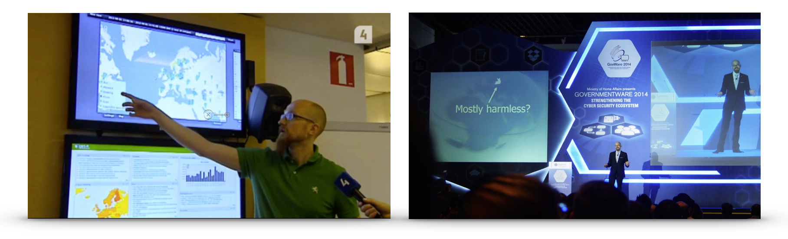

# What is OUSPG

TLDR; We break software. We learn from it, and empower
the world ship more secure software. We are pretty good at is and it is
likely that some software you depend on, is more secure because of us.

# Unlocked Achievements

Below, we give practical examples of our work.

 * PROTOS SNMP test tool revealed vulnerabilities in implementations from
   hundreds of vendors, such as Apple, Cisco, Dell, Juniper and Microsoft

 * Relentless work of [Atte Kettunen](https://youtu.be/wO1LU_QKroQ) - over 300
   vulnerabilities, from which 90 are in popular browsers - billions of users
   use more browsers

# Careers

OUSPG has employed over 30 persons over the course of 20 years.
It has been the stepping-stone for many careers which have influenced who the
world looks at security and tech in general.

 * Founders of an international thought-leader company, making security testing
   a standard practice, not only in IT, but also medical, automotive, industry control
   systems and other

 * Founders of an international though-leader company, impacting on how many
   nations approach national cyber security

 * Employees targeted by the head-hunters of world-famous companies, such as
   Google and Microsoft

 * A cyber defender in a senior technical role at a national cyber security
  centre - also advising other nations.

