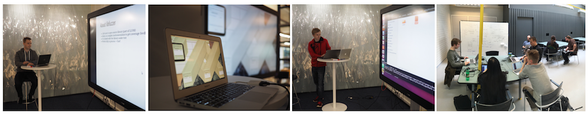

# OUSPG Open goes Helsinki

TL;DR OUSPG Open goes Helsinki. Muisteloidaan nopeasti
OUSPG:n 20 vuoden tarina, katsotaan mitä olemme oppineet OUSPG Open kesäpöhinöistä ja valoitetaan vähän mitä uutta Oulusta on odotettavissa tulevaisuudessa.

Perjantaina 5.8 klo 12:00 Yrjönkatu 11 D 22 Codenomicon/Clarified Networks/Synopsys, Helsinki. Tervetuloa!

----

*OO US PEEKEen avoimet kesäpöhinät popularisoi fussausta ja TLS-tarkastuksia*

Alakkonää mua Perjantaina 5.8 kello kakstoista etteenpäin?

Muutama OUSPEEKEE alumni päätti vähä pistää hommia tolokummaks.
Ekana synty semmone OUSPEEKEE Ouppeni. Samalla tultiin täyttäneeks kakskytä. Tulevaisuuvelle on kovat suunitelemat.

On ollu sen verta jännää, että aateltiin, että isolla kirkolla pitäs käyvä
kertomassa kuulumiset. Kysyttiin Sypsyykseltä tilat Yrjönkavulta ja ne anto.

Toiveena ois että Suomen kyperturvallisuudesta vastuuta kantavat vieraat
kertosivat kans kuulumisesa. Saatamma sitte siitä kirkolle lähtijä, että jos
iltavappaata löytyy niin mukkaa vaa.

Mitä:
 * 20 vuotta OUSPG:tä - mitä on tullutkaan tehtyä
 * OUSPG Open kesäpöhinät - mitä ne nyt meni tekemään?
 * Tulevaisuus
 * Käytännön esimerkki kesäpöhinöistä: Kasper Kyllönen 17v 
    * [URL Handlerit](https://github.com/ouspg/urlhandlers) ja 
    * [Honeypot-päivitys](https://github.com/ouspg/honeypots)

Missä:
 * Synopsysken Government Showroom, Yrjönkatu 11 D 22 Codenomicon/Clarified Networks/Synopsys, Helsinki

Milloin:
 * Perjantaina 5.8 klo 12:00. Kesän kunniaksi poistuminen omaan tahtiin. 
